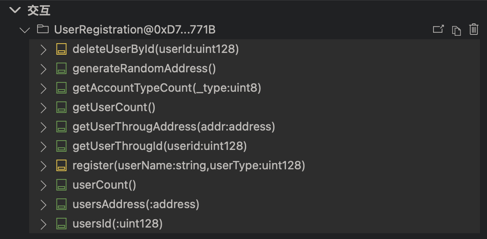

# DAPP 接口更新 for 小蔡蔡

## 用户注册登录部分

### 1.用户信息查询

接口地址: `http://www.xianxiangchain.xyz/DAPP/login.php`
数据传递方法: `POST`
传递数据： `{'requestType'：1,'appSecurityCode':'DAPP2023'}`
返回数据示例:

```
{
    "message": "获取数据成功!",
    "userData": [
        {
            "用户ID": "1",
            "用户昵称": "John Doe",
            "用户密码": "password123",
            "用户注册时间": "2023-11-12 01:42:22",
            "用户身份代码": "1"
        },
        {
            "用户ID": "3",
            "用户昵称": "Shufan Cai",
            "用户密码": "1234",
            "用户注册时间": "2023-11-12 14:41:36",
            "用户身份代码": "1"
        }
    ]
}
```

功能描述: 返回了DAPP用户信息登记表中的所有注册信息

### 2.用户登录校验

接口地址: `http://www.xianxiangchain.xyz/DAPP/login.php`
数据传递方法: `POST`
传递数据： `{'requestType'：2,'appSecurityCode':'DAPP2023','userAccount':'用户昵称','userPassword':'用户密码'}`
传递数据示例:`{'requestType'：2,'appSecurityCode':'DAPP2023','userAccount':'Shufan Cai','userPassword':'1234'}`
返回数据示例: 成功

```
{
    "message": "Login successful",
    "userData": {
        "用户ID": "3",
        "用户昵称": "Shufan Cai",
        "用户密码": "1234",
        "用户注册时间": "2023-11-12 14:41:36",
        "用户身份代码": "1"
    }
}
```

失败案例:

```
{
    "error": "Login failed. Check your credentials."
}
```

功能描述: 当requestType=2的时候,开始进行登录校验. 输入相应数据可以查询到是否存在该用户信息.

### 3.用户信息注册接口

接口地址: `http://www.xianxiangchain.xyz/DAPP/registration.php`
数据传递方法: `POST`
传递数据： `{'appSecurityCode':'DAPP2023','userAccount':'用户昵称','userPassword':'用户密码','userType':'用户身份代码'}`
传递数据示例:`{'appSecurityCode':'DAPP2023','userAccount':'Jianfei Yang','userPassword':'123','userType':'1'}`
返回数据示例: 成功\

```
{
"message": "用户注册成功。"
}
```

对应数据库截图: 成功写入


智能合约接口说明文档：第一部分 用户登录注册、查询合约




1. generateRandomAddress() 生成一个随机的哈希地址 不需要参数
2. getAccountTypeCount() 获得某一类身份的用户总数 参数：int 0～2 0-运营方 1-卖家 2-消费者
3. getUserCount() 获得合约中用户总数 不需要参数
4. getUserThroughId() 通过 ID 查询用户 参数：int 该用户的 ID 值
5. register() 注册、添加新用户 参数：1.用户名 string  2.身份类型 int
6. userCount() 获得合约中用户总数
7. usersAddress() 根据地址搜索用户 参数：哈希地址
8. userId() 根据 ID 搜索用户 参数：int 用户ID

备注： 之所以有些功能看起来重复 是因为 solidity 的语言特性 选一个用就好。
